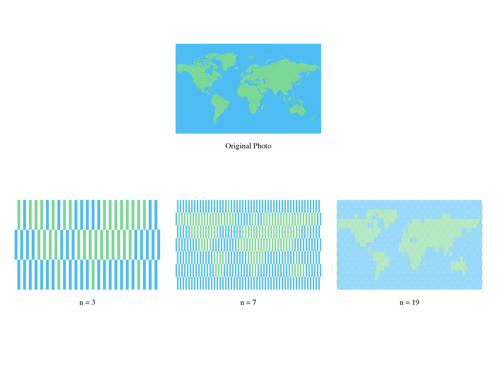

# Climate_Logo_Generator
A simple implementation of Main Color Picker and Photo Processor for generating a very particular type of picture. The code was finished at October, 2018.

## Why
Climate is about the planet earth and every individual nurtured and living on it. That’s why I try to abstract the geographic earth, the most macroscopic environment, in a similar way usually used by biologist to indicate DNA and gene, the most microscopic elements of a life. By this graphical experiment, I want to emphasis the embedded connection and balance, in which climate plays an irreplaceable role, between lives and large-scale land and ocean. Red tags mark the places once had climate or environmental issues, like floods, leaks, etc., or reported to be extremely hot in the foreseeable future. These tags make the logo become also a warning of our pressing task and responsibility. Moreover, probably even a dynamic sign and documentary of the world climate changing: We want to see them become less and less.

## How
The Generator is based on
1. A main color picker;
2. A photo dimension measurer;
3. A color brick replacer  

And would transform any photo into the very particular type of shape and form.

### Example

